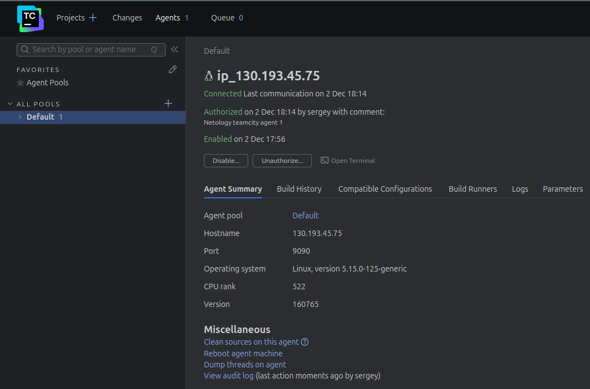

#### Подготовка
- Создаём виртуальные машины
- Клонируем репозиторий:  
https://github.com/SergueiMoscow/example-teamcity

#### Создание нового секретного ключа в GitHub

#### Создано соединение для GitHub

#### Авторизируем агента

#### Запускаем первый build

#### Добавляем step с условием сборки

https://github.com/settings/applications/2798646

#### Меняем ip для nexus и пушим example проект

#### Также меняем версию на 0.0.3, иначе build завершается с ошибкой

#### Проверяем в nexus

#### Добавляем конфигурацию в репозиторий
[Результат](https://github.com/SergueiMoscow/example-teamcity/tree/master/.teamcity)

#### Добавляем метод и тест на него

#### Убедились, что сборка на новой ветке запустилась

#### Ветку смержили
- тестовый build прошёл успешно, сборка master завалилась, т.к. не поменяли версию, и была попытка создать новый артефакт. Он не создался

#### Меняем версию
- После смены версии на 0.0.4 сборка master прошла успешно 

- артефакты создались

